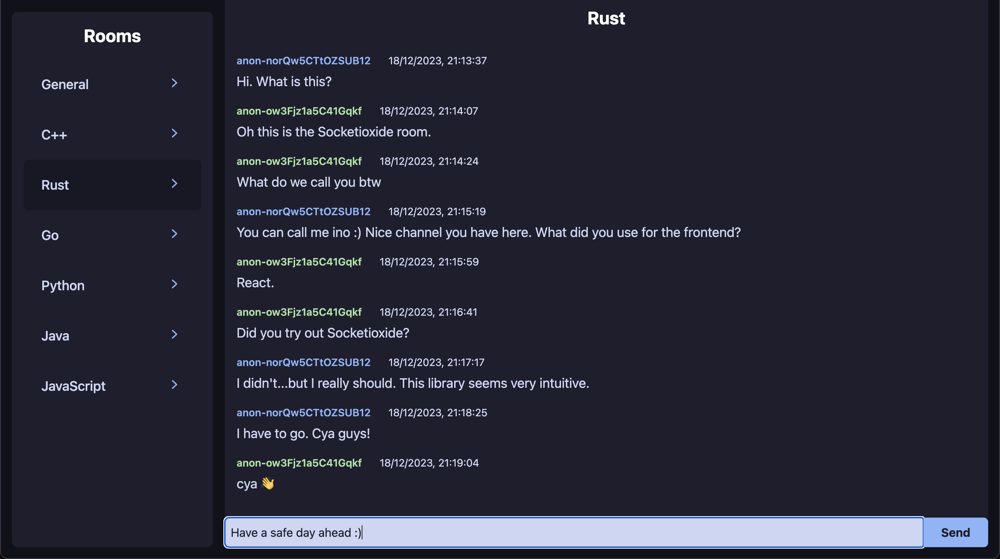

# Chat Room With Loco Backend
This repo provides the backend using [Loco](https://github.com/loco-rs/loco) and frontend for the Rust Socket.io

The building instructions for the client can be found in the `client` folder.

To run the server, `cd` into this directory and run `cargo loco start` command.

App Screenshot:
